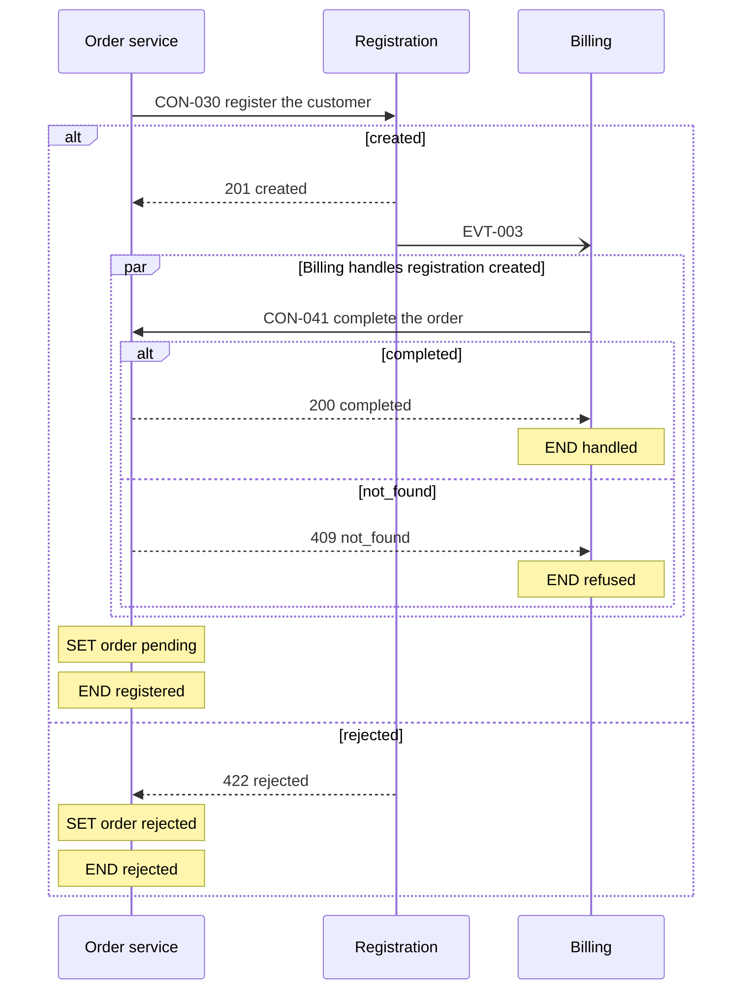

# A customer registers and is billed

```mermaid
sequenceDiagram
participant O as Order service
participant R as Registration
participant B as Billing
O->>R: CON-030 register the customer
alt created
    R-->>O: 201 created
    R-)B: EVT-003
    par Billing handles registration created
        B->>O: CON-041 complete the order
        alt completed
            O-->>B: 200 completed
            Note over B: END handled
        else not_found
            O-->>B: 409 not_found
            Note over B: END refused
        end
    end
    Note over O: SET order pending
    Note over O: END registered
else rejected
    R-->>O: 422 rejected
    Note over O: SET order rejected
    Note over O: END rejected
end
```
