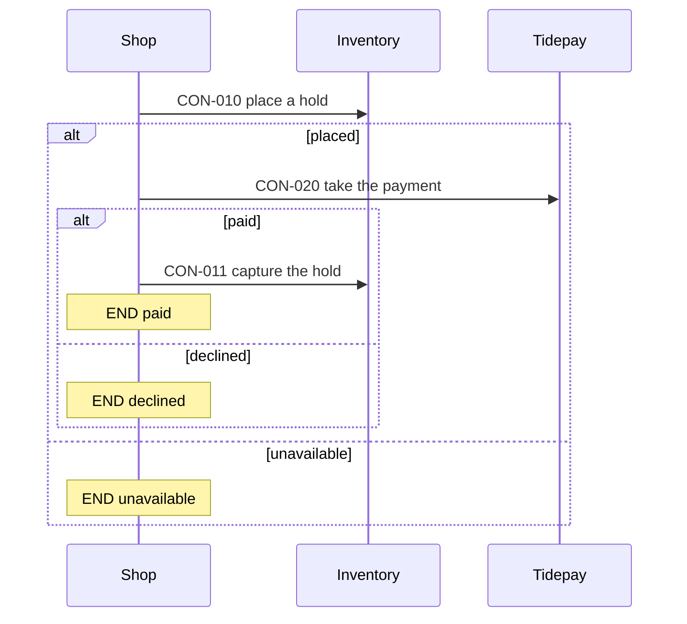

# A customer buys an item

```mermaid
sequenceDiagram
participant S as Shop
participant I as Inventory
participant T as Tidepay
S->>I: CON-010 place a hold
alt placed
    S->>T: CON-020 take the payment
    alt paid
        S->>I: CON-011 capture the hold
        Note over S: END paid
    else declined
        Note over S: END declined
    end
else unavailable
    Note over S: END unavailable
end
```
