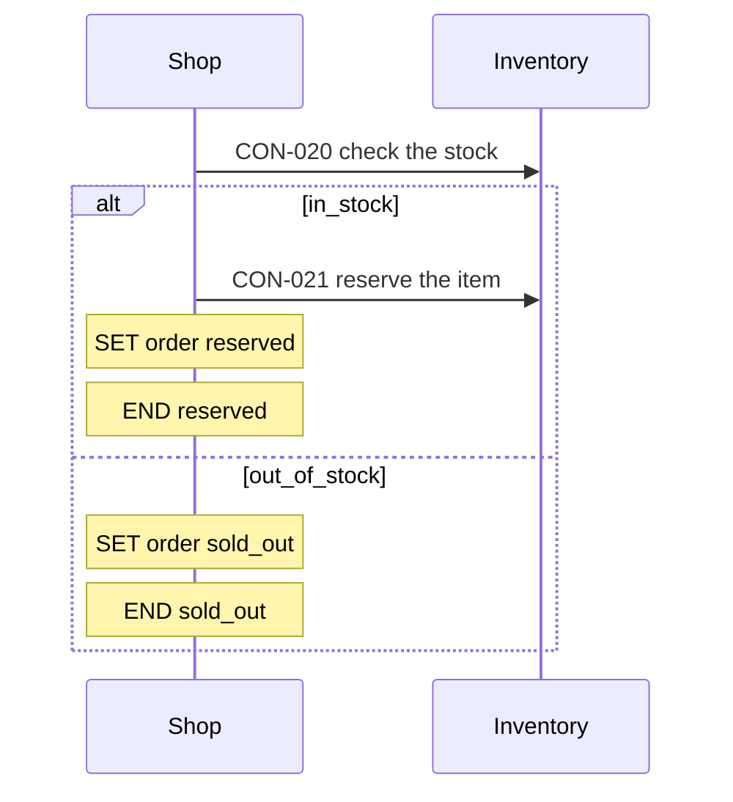

# A customer reserves the last item

```mermaid
sequenceDiagram
participant S as Shop
participant I as Inventory
S->>I: CON-020 check the stock
alt in_stock
    S->>I: CON-021 reserve the item
    Note over S: SET order reserved
    Note over S: END reserved
else out_of_stock
    Note over S: SET order sold_out
    Note over S: END sold_out
end
```
