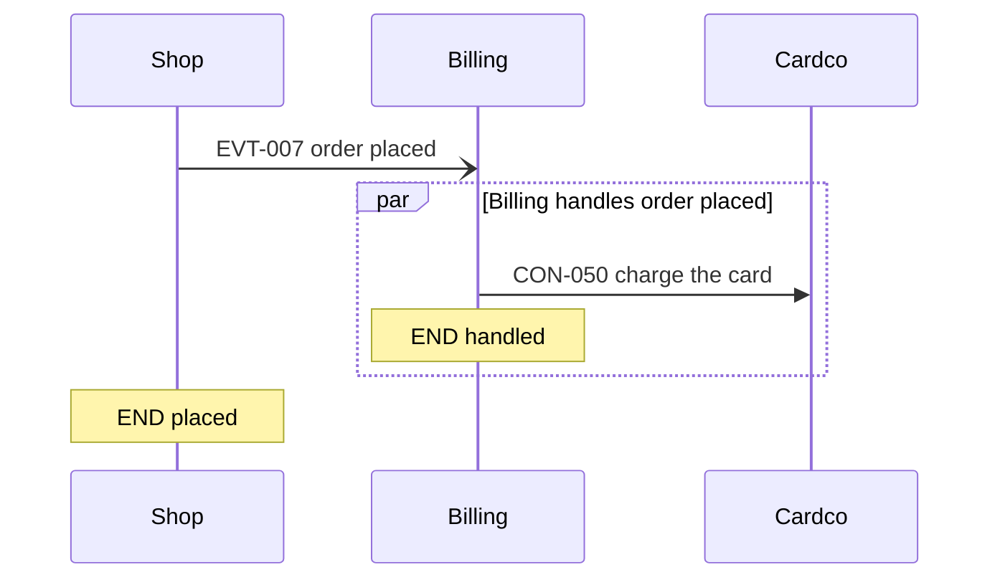

# An order is billed

```mermaid
sequenceDiagram
participant S as Shop
participant B as Billing
participant C as Cardco
S-)B: EVT-007 order placed
par Billing handles order placed
    B->>C: CON-050 charge the card
    Note over B: END handled
end
Note over S: END placed
```
