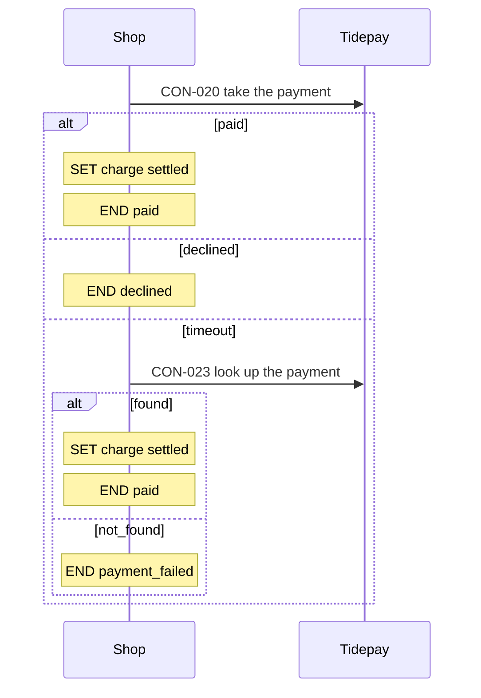

# A customer pays

```mermaid
sequenceDiagram
participant S as Shop
participant T as Tidepay
S->>T: CON-020 take the payment
alt paid
    Note over S: SET charge settled
    Note over S: END paid
else declined
    Note over S: END declined
else timeout
    S->>T: CON-023 look up the payment
    alt found
        Note over S: SET charge settled
        Note over S: END paid
    else not_found
        Note over S: END payment_failed
    end
end
```
