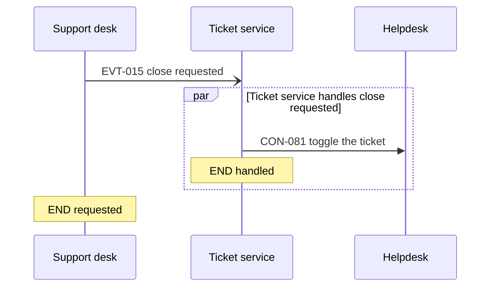

# A ticket is closed

```mermaid
sequenceDiagram
participant S as Support desk
participant B as Ticket service
participant H as Helpdesk
S-)B: EVT-015 close requested
par Ticket service handles close requested
    B->>H: CON-081 toggle the ticket
    Note over B: END handled
end
Note over S: END requested
```
