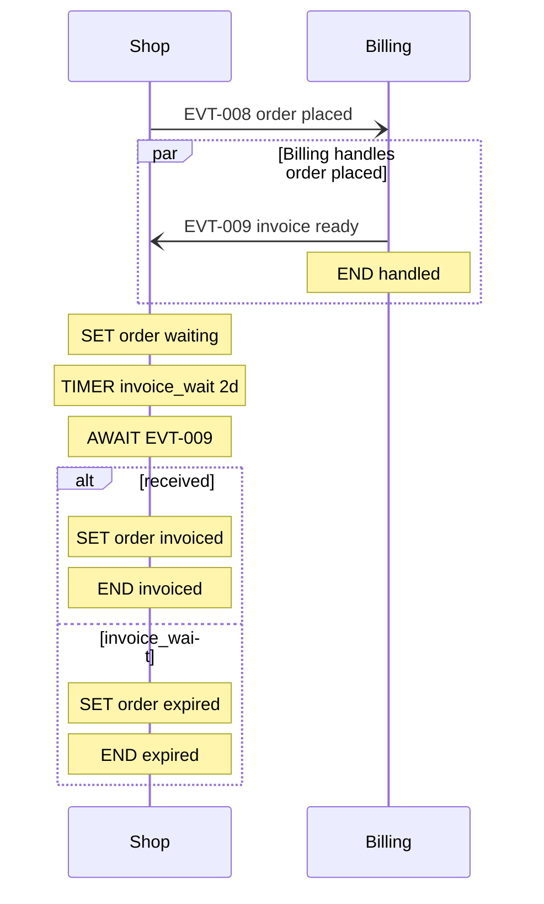

# An order waits for its invoice

```mermaid
sequenceDiagram
participant S as Shop
participant B as Billing
S-)B: EVT-008 order placed
par Billing handles order placed
    B-)S: EVT-009 invoice ready
    Note over B: END handled
end
Note over S: SET order waiting
Note over S: TIMER invoice_wait 2d
Note over S: AWAIT EVT-009
alt received
    Note over S: SET order invoiced
    Note over S: END invoiced
else invoice_wait
    Note over S: SET order expired
    Note over S: END expired
end
```
