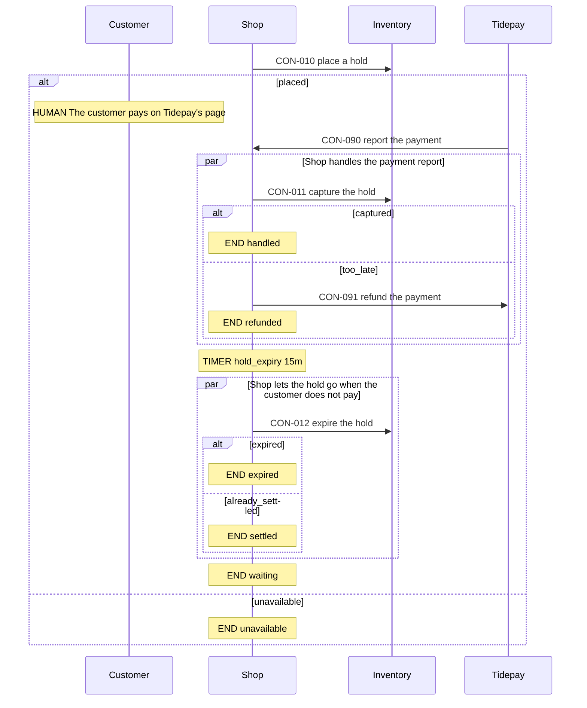

# A customer pays on the provider's page

```mermaid
sequenceDiagram
participant W as Customer
participant S as Shop
participant I as Inventory
participant T as Tidepay
S->>I: CON-010 place a hold
alt placed
    Note over W: HUMAN The customer pays on Tidepay's page
    T->>S: CON-090 report the payment
    par Shop handles the payment report
        S->>I: CON-011 capture the hold
        alt captured
            Note over S: END handled
        else too_late
            S->>T: CON-091 refund the payment
            Note over S: END refunded
        end
    end
    Note over S: TIMER hold_expiry 15m
    par Shop lets the hold go when the customer does not pay
        S->>I: CON-012 expire the hold
        alt expired
            Note over S: END expired
        else already_settled
            Note over S: END settled
        end
    end
    Note over S: END waiting
else unavailable
    Note over S: END unavailable
end
```
