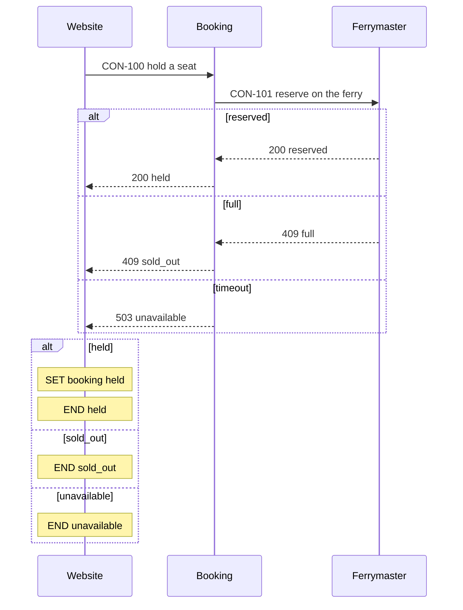

# A traveller holds a seat

```mermaid
sequenceDiagram
participant W as Website
participant B as Booking
participant F as Ferrymaster
W->>B: CON-100 hold a seat
B->>F: CON-101 reserve on the ferry
alt reserved
    F-->>B: 200 reserved
    B-->>W: 200 held
else full
    F-->>B: 409 full
    B-->>W: 409 sold_out
else timeout
    B-->>W: 503 unavailable
end
alt held
    Note over W: SET booking held
    Note over W: END held
else sold_out
    Note over W: END sold_out
else unavailable
    Note over W: END unavailable
end
```
