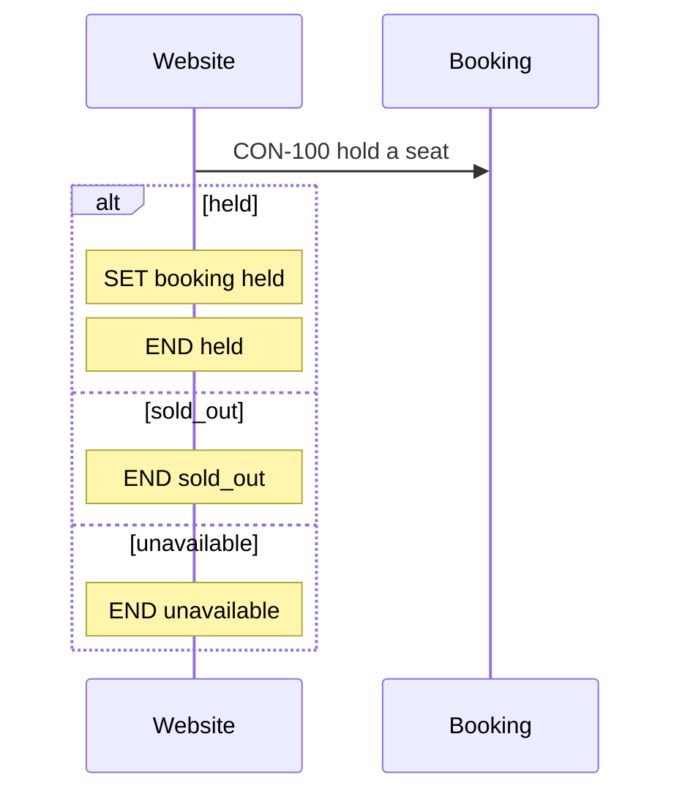

# A traveler holds a seat

```mermaid
sequenceDiagram
participant W as Website
participant B as Booking
W->>B: CON-100 hold a seat
alt held
    Note over W: SET booking held
    Note over W: END held
else sold_out
    Note over W: END sold_out
else unavailable
    Note over W: END unavailable
end
```
