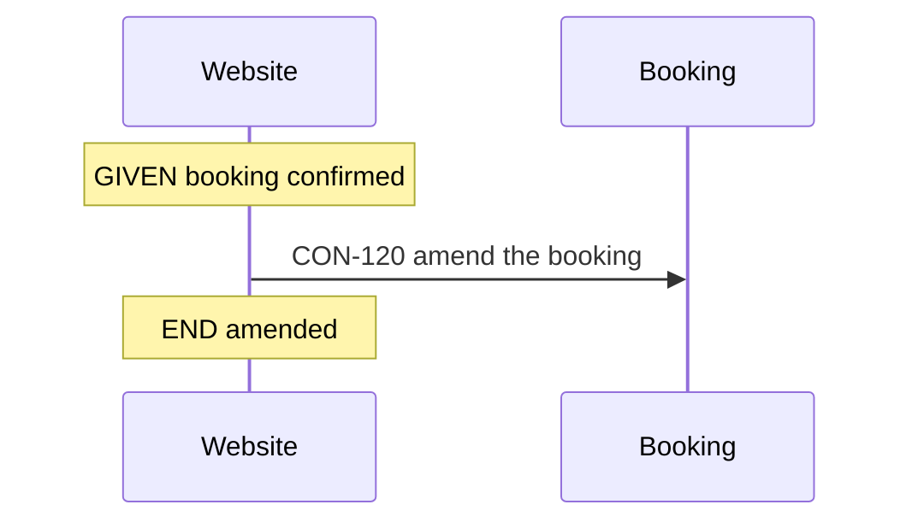

# A traveller amends

```mermaid
sequenceDiagram
participant W as Website
participant B as Booking
Note over W: GIVEN booking confirmed
W->>B: CON-120 amend the booking
Note over W: END amended
```
