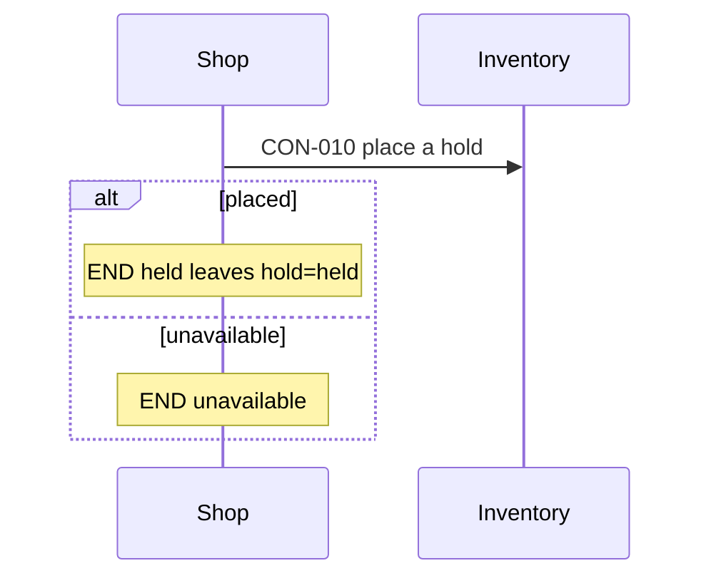

# A customer holds an item

```mermaid
sequenceDiagram
participant S as Shop
participant I as Inventory
S->>I: CON-010 place a hold
alt placed
    Note over S: END held leaves hold=held
else unavailable
    Note over S: END unavailable
end
```
