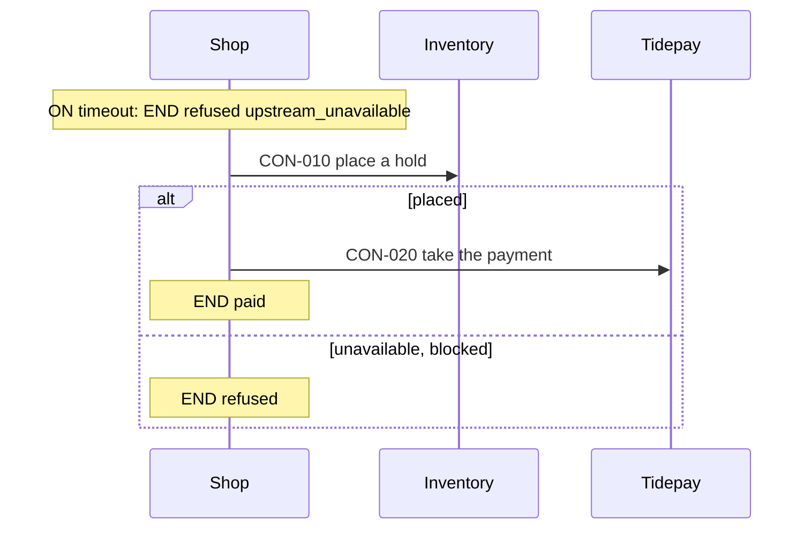

# A customer holds and pays

```mermaid
sequenceDiagram
participant S as Shop
participant I as Inventory
participant T as Tidepay
Note over S: ON timeout: END refused upstream_unavailable
S->>I: CON-010 place a hold
alt placed
    S->>T: CON-020 take the payment
    Note over S: END paid
else unavailable, blocked
    Note over S: END refused
end
```
