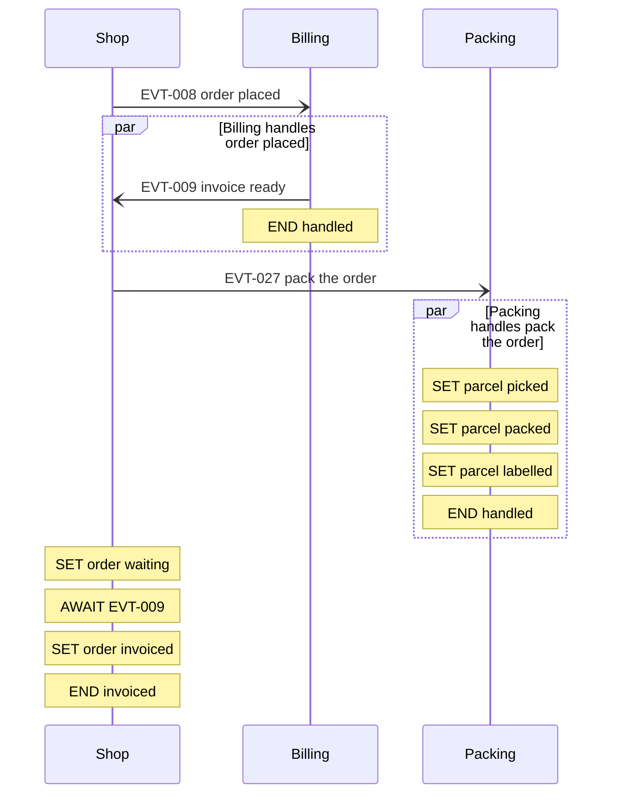

# An order waits while it is packed

```mermaid
sequenceDiagram
participant S as Shop
participant B as Billing
participant K as Packing
S-)B: EVT-008 order placed
par Billing handles order placed
    B-)S: EVT-009 invoice ready
    Note over B: END handled
end
S-)K: EVT-027 pack the order
par Packing handles pack the order
    Note over K: SET parcel picked
    Note over K: SET parcel packed
    Note over K: SET parcel labelled
    Note over K: END handled
end
Note over S: SET order waiting
Note over S: AWAIT EVT-009
Note over S: SET order invoiced
Note over S: END invoiced
```
