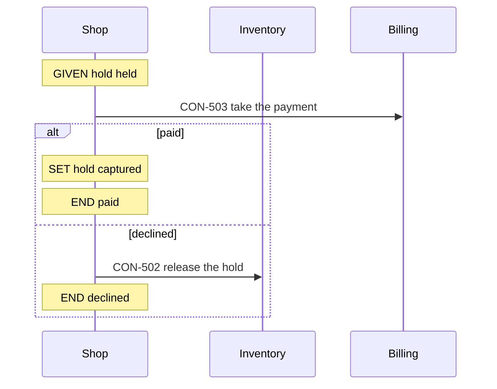

# A customer pays for the held item

```mermaid
sequenceDiagram
participant S as Shop
participant I as Inventory
participant B as Billing
Note over S: GIVEN hold held
S->>B: CON-503 take the payment
alt paid
    Note over S: SET hold captured
    Note over S: END paid
else declined
    S->>I: CON-502 release the hold
    Note over S: END declined
end
```
