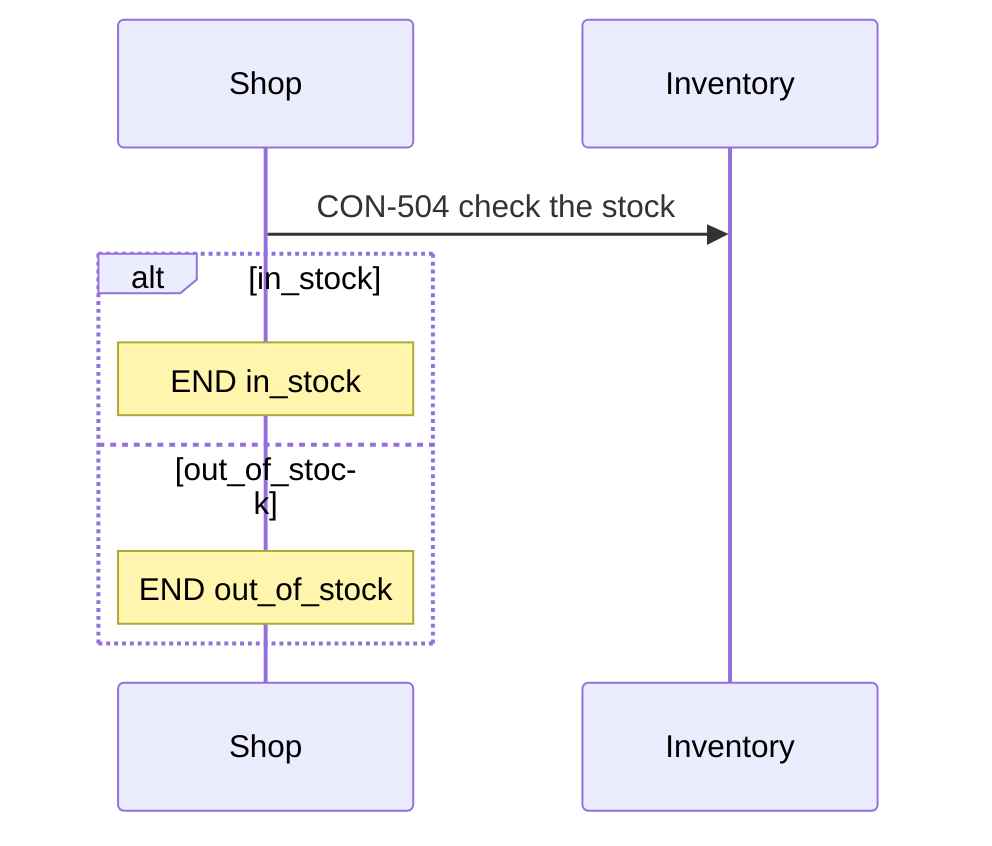

# A customer looks up the stock

A customer checks whether the item is in stock before holding it.

```mermaid
sequenceDiagram
participant S as Shop
participant I as Inventory
S->>I: CON-504 check the stock
alt in_stock
    Note over S: END in_stock
else out_of_stock
    Note over S: END out_of_stock
end
```
