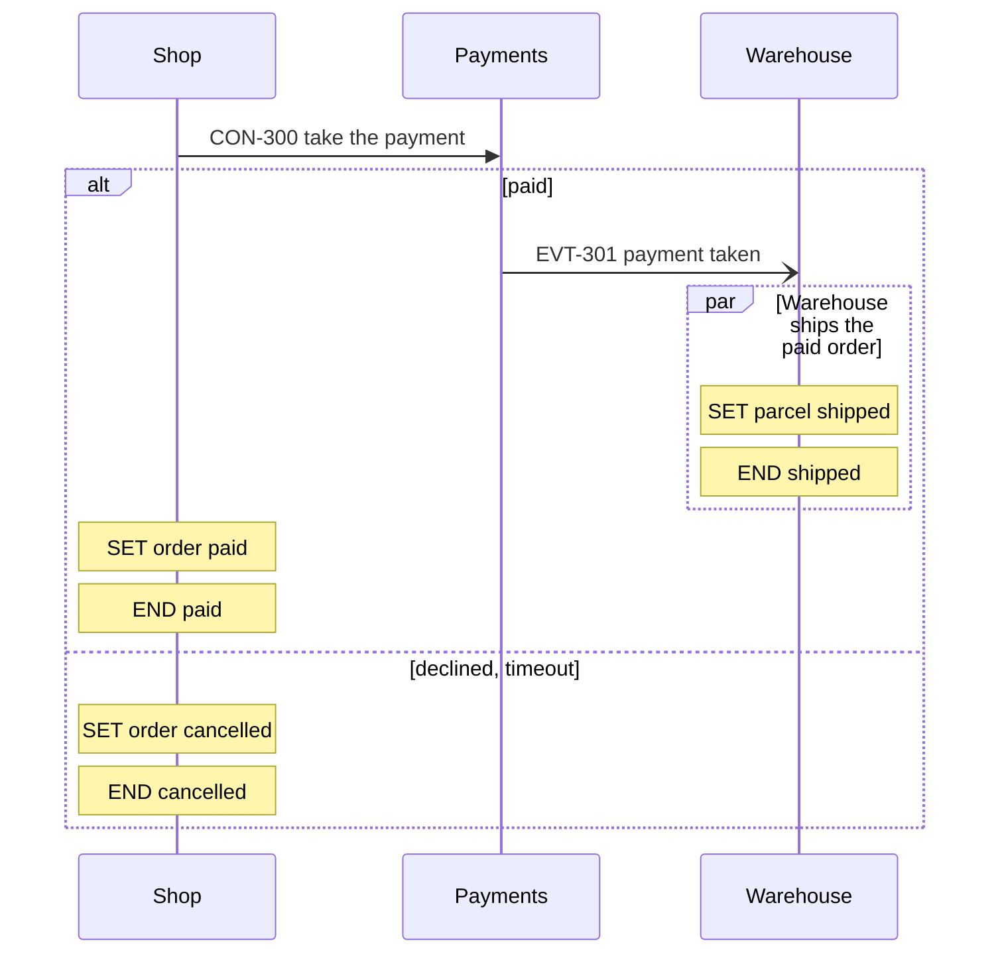

# Pay, then ship

```mermaid
sequenceDiagram
participant S as Shop
participant P as Payments
participant W as Warehouse
S->>P: CON-300 take the payment
alt paid
    P-)W: EVT-301 payment taken
    par Warehouse ships the paid order
        Note over W: SET parcel shipped
        Note over W: END shipped
    end
    Note over S: SET order paid
    Note over S: END paid
else declined, timeout
    Note over S: SET order cancelled
    Note over S: END cancelled
end
```
