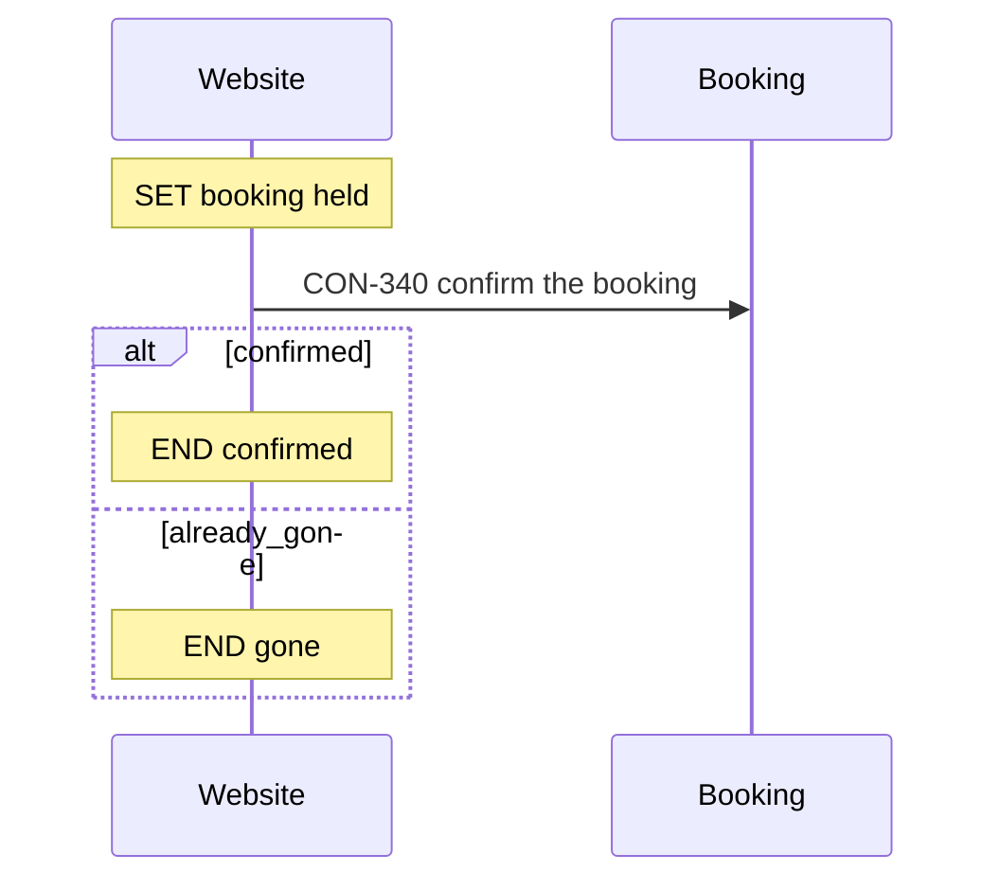

# Confirm a held booking

```mermaid
sequenceDiagram
participant W as Website
participant B as Booking
Note over W: SET booking held
W->>B: CON-340 confirm the booking
alt confirmed
    Note over W: END confirmed
else already_gone
    Note over W: END gone
end
```
