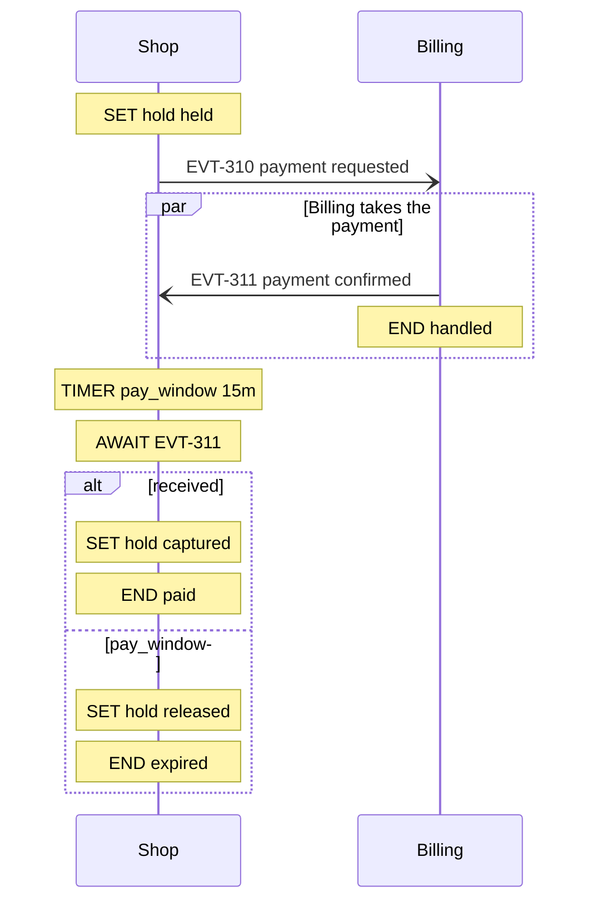

# Pay within the window

```mermaid
sequenceDiagram
participant S as Shop
participant B as Billing
Note over S: SET hold held
S-)B: EVT-310 payment requested
par Billing takes the payment
    B-)S: EVT-311 payment confirmed
    Note over B: END handled
end
Note over S: TIMER pay_window 15m
Note over S: AWAIT EVT-311
alt received
    Note over S: SET hold captured
    Note over S: END paid
else pay_window
    Note over S: SET hold released
    Note over S: END expired
end
```
