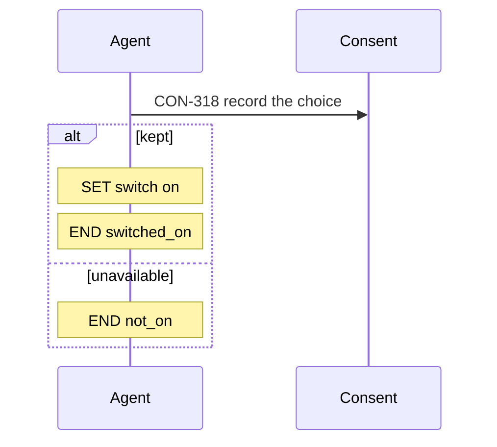

# Switch the agent on

```mermaid
sequenceDiagram
participant A as Agent
participant C as Consent
A->>C: CON-318 record the choice
alt kept
    Note over A: SET switch on
    Note over A: END switched_on
else unavailable
    Note over A: END not_on
end
```
