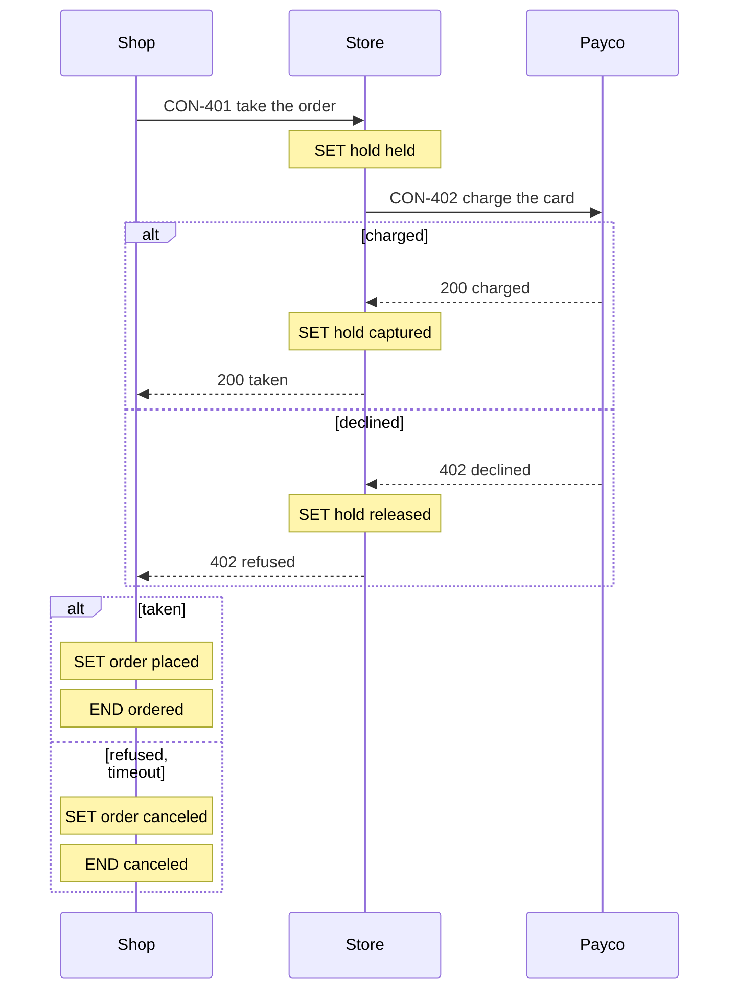

# A customer orders

```mermaid
sequenceDiagram
participant S as Shop
participant T as Store
participant P as Payco
S->>T: CON-401 take the order
Note over T: SET hold held
T->>P: CON-402 charge the card
alt charged
    P-->>T: 200 charged
    Note over T: SET hold captured
    T-->>S: 200 taken
else declined
    P-->>T: 402 declined
    Note over T: SET hold released
    T-->>S: 402 refused
end
alt taken
    Note over S: SET order placed
    Note over S: END ordered
else refused, timeout
    Note over S: SET order canceled
    Note over S: END canceled
end
```
